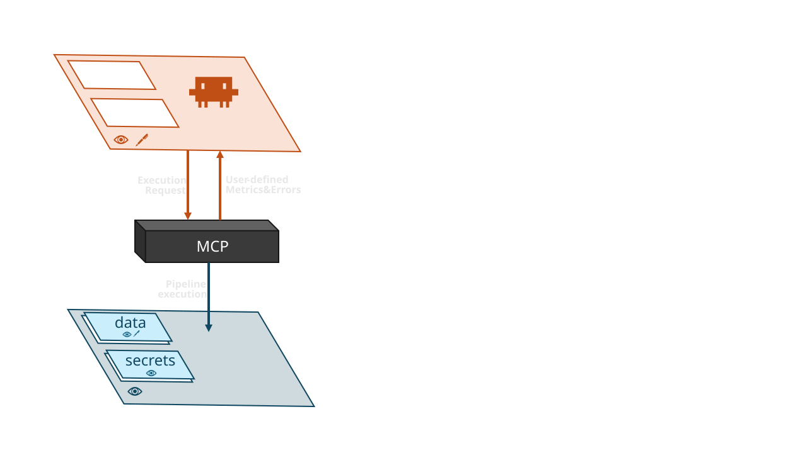

# blinded-claude

**Let Claude Code develop and run data pipelines without ever seeing the data.**

`blinded-claude` is a two-container Docker starter. One container runs Claude
Code with nothing but **editable source code**; the other holds the **regulated
data** and runs the pipelines. Claude reaches the data side *only* through a
handful of MCP tools that return aggregated metrics and structured error
locations — never raw rows. The result: an AI agent that can author, run, and
debug a [Kedro](https://kedro.org) pipeline while staying blind to the dataset it
runs against.

---

## Why this exists

If you work with sensitive or regulated data, you can't just point an LLM agent
at it. But you still want the agent's help building the pipeline. The trick is to
**separate the place code is written from the place data lives**, and to make the
only channel between them a small, auditable set of return values.



```
   dev container (Claude Code)            mcp_server container (the data side)
 ┌───────────────────────────┐         ┌───────────────────────────────────┐
 │ • Claude Code             │  MCP/SSE │ • runs Kedro pipelines            │
 │ • editable src/ + conf/   │ ───────► │ • holds data/ (regulated)         │
 │ • NO data, NO route to    │ ◄─────── │ • read-only filesystem            │
 │   the data side's data     │ results │ • NO internet                     │
 └───────────────────────────┘         └───────────────────────────────────┘
        external net                          internal-only bridge net
     (Anthropic API only)                  (no route to the internet)
```

**The invariant that makes it sound:** once Claude can edit pipeline code, the
data's only escape route is *whatever the MCP tools return*. So:

- `data/` and `conf/local/` (credentials) are **never** mounted into the dev
  container — only `conf/base/` is.
- `src/` and `conf/` are **read-only** on the data side (kernel-enforced
  read-only filesystem; `data/` is the single writable path).
- The data-side container has **no internet** (internal-only Docker network).
- The MCP tools return **numbers and code locations only** — no dataset rows, no
  raw stdout, no exception messages.

No shared writable filesystem + no network egress + curated tool outputs ⇒ the
loop is closed.

---

## What the agent can and can't see

| MCP tool | Returns | Carries data? |
|----------|---------|---------------|
| `run_pipeline` | a `run_id` | no |
| `get_run_status` | status + node progress counts | no |
| `get_metrics` | **numeric** metrics only (strings/arrays dropped) | no |
| `get_run_error` | exception **type** + source **location** (file/line/function) | no |
| `list_runs` | all runs this session | no |

`get_run_error` deliberately
omits the exception *message* and reports only the exception class and where in
your code it occurred, so Claude can debug a `KeyError` at `nodes.py:42` without
seeing the offending value. This is to prevent unintentional leaks from third pary
dependencies.

> **Residual channels (by design).** A few low-bandwidth signals remain: return
> code, node count/names, run timing, metric *keys*, and the exception class
> name. These leak a few bytes per run, not bulk data. If your threat model needs
> them closed, add a metric-key allowlist and normalize statuses/timings — see
> `mcp_server/server.py`.

---

## Repository layout

```
.
├── docker-compose.yml          # the two-container security boundary
├── claude.md                   # guide loaded by the in-container Claude
├── .devcontainer/
│   └── devcontainer.json       # VS Code "Reopen in Container" → dev service
├── dev_container/
│   ├── Dockerfile              # node:20-slim + Claude Code (no python, no data)
│   └── claude_mcp_config.json  # points Claude at http://mcp_server:8000/sse
├── mcp_server/
│   ├── Dockerfile
│   ├── requirements.txt
│   ├── server.py               # MCP server: the 5 tools above
│   └── pipeline_runner.py      # runs Kedro in an isolated subprocess, data-free errors
└── kedro_project/
    ├── conf/base/              # catalog.yml + parameters.yml (editable on both sides)
    ├── conf/local/             # credentials (gitignored; data side only, never on the agent side)
    ├── data/                   # lives on the data side only (gitignored, never committed)
    ├── seed_data.py            # generates synthetic demo data
    └── src/dummy_project/      # pipelines: data_science (+ failing, for error tests)
```

---

## Prerequisites

- **Docker Desktop** (with Compose v2). On Windows, the WSL2 backend is fine.
- A **Claude subscription** (for OAuth login) or an Anthropic API setup token.
- *Optional:* **VS Code** + the **Dev Containers** extension, if you want the
  "Reopen in Container" workflow instead of the terminal.

---

## Quick start

```bash
git clone <your-fork-url> blinded-claude
cd blinded-claude

# 1. Build both images.
docker compose build

# 2. Seed synthetic demo data on the data side (no local Python needed).
#    Writes kedro_project/data/01_raw/dummy_data.csv.
docker compose run --rm mcp_server python /app/kedro_project/seed_data.py

# 3. Start the stack.
docker compose up -d

# 4. Log Claude in (OAuth, one time — saved in the claude_config volume).
docker compose exec dev claude
#    ...follow the browser + paste-code prompt, then ask it to run the pipeline.
```

Then, inside that `claude` session, try:

> Run the default pipeline, wait for it to finish, and show me the metrics.

Claude will call `run_pipeline` → poll `get_run_status` → read `get_metrics`.
To exercise the error path:

> Run the `failing` pipeline and tell me where it broke.

Tear everything down with `docker compose down` (add `-v` to also drop the saved
Claude login).

### Alternative: VS Code "Reopen in Container"

Open the folder in VS Code → **Reopen in Container**. This attaches VS Code to
the `dev` service (which starts `mcp_server` via `depends_on`). Open a terminal
and run `claude`. The MCP tools are reachable immediately.

### Alternative auth: inject a token instead of interactive login

Run `claude setup-token` on your host (where a browser is available), then:

```bash
# bash
export CLAUDE_CODE_OAUTH_TOKEN=...    # the token you just generated
docker compose up -d
```
```powershell
# PowerShell
$env:CLAUDE_CODE_OAUTH_TOKEN = "..."
docker compose up -d
```

---

## Using your own data and pipeline

1. **Drop your dataset** in `kedro_project/data/01_raw/` (gitignored — it stays
   local and never reaches the dev container or git). Delete `seed_data.py` and
   the synthetic CSV once you switch.
2. **Update the catalog** in `kedro_project/conf/base/catalog.yml` to point at
   your file and define your outputs. Keep persisted outputs to **aggregated
   metrics** (`json.JSONDataset`, `versioned: true`) so only scalars are exposed.
3. **Write your pipeline** under `kedro_project/src/dummy_project/pipelines/` —
   Claude can do this from inside the dev container, since `src/` and
   `conf/base/` are mounted read-write there.
4. **Run it via the MCP tools.** Execution always happens on the data side; the
   dev container has no Python and no data, by design.

**Credentials** (DB passwords, API keys for your data sources) go in
`kedro_project/conf/local/credentials.yml`. That path is gitignored **and**
mounted only into the data-side `mcp_server` container — never into the dev
container — so pipelines authenticate at run time while the agent stays blind to
the secrets.

Anything a node writes must stay under `data/` (enforced two ways: the
`ConfineWritesToData` catalog lint, and the read-only container filesystem).

---

## External logging (MLflow, experiment trackers, etc.)

**Out of the box this won't work, by design.** The data-side container is on an
**internal-only network with no route to the internet**, so pipeline code cannot
reach an external `https://mlflow.example.com` That "no egress" property is the
load-bearing part of the security model: since the agent authors the pipeline code,
any outbound channel is a potential exfiltration channel. MLflow in particular is a
*full* data sink, not a metrics-only one (`log_artifact`/`log_dict`/`log_text` upload arbitrary
content, and even tags/params take arbitrary strings), so "just allow MLflow"
would reopen the leak.

Recommended: manually run the tracker *inside* the perimeter.

---

## How it works (under the hood)

- `run_pipeline` launches `pipeline_runner.py` in an **isolated subprocess** — a
  node never shares the MCP server's memory, so it can't reach in and tamper with
  the tools.
- On failure, the runner walks the traceback with Python's `traceback` module and
  emits a single sentinel-prefixed JSON line containing only the exception class
  and project-relative code locations. The server trusts only the **last**
  sentinel line, so a node can't spoof an earlier one.
- `get_metrics` reads the newest file under `data/09_tracking/` and keeps only
  numeric values (booleans excluded), so rows can't ride out as string "metrics".

For the in-container agent's day-to-day workflow, see **[`claude.md`](claude.md)**
(it's auto-loaded as project instructions inside the dev container).

---

## Troubleshooting

- **`docker version` segfaults / Dev Containers fails to start under WSL.**
  WSL's `~/.docker/config.json` may point `currentContext` at a Windows named
  pipe. Fix with `docker context use default`, or add
  `export DOCKER_HOST=unix:///var/run/docker.sock` to your WSL `~/.bashrc`.
- **`claude` says it isn't authenticated.** Re-run `docker compose exec dev
  claude` to log in, or set `CLAUDE_CODE_OAUTH_TOKEN` before `docker compose up`.
  The login persists in the `claude_config` volume across rebuilds.
- **`get_metrics` says no metrics yet.** Run a pipeline first; metrics appear
  under `data/09_tracking/` only after a successful run.

---

## Security note

This is a **starter**, not a certified control. It demonstrates a sound
architecture (no data on the agent side, no egress on the data side, curated tool
outputs) and closes the high-bandwidth leaks. Review it against your own threat
model, especially the residual channels noted above, before trusting it with
real regulated data.
